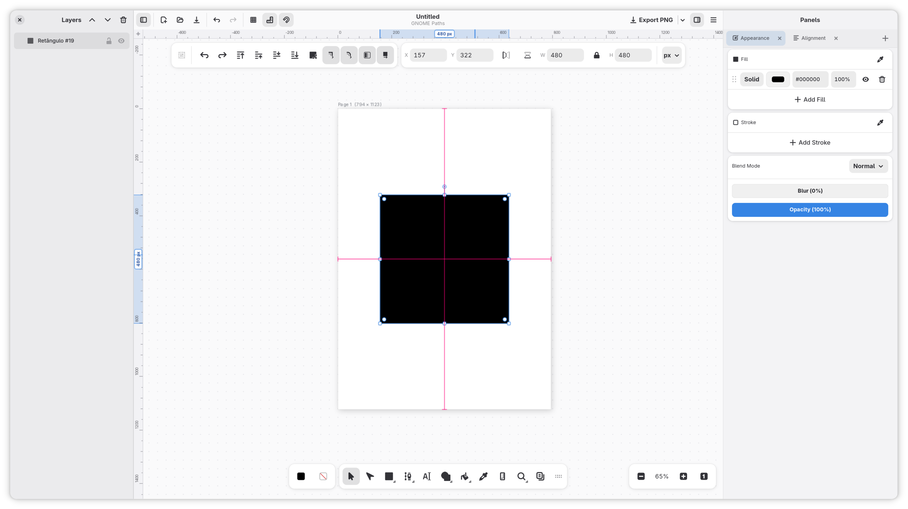
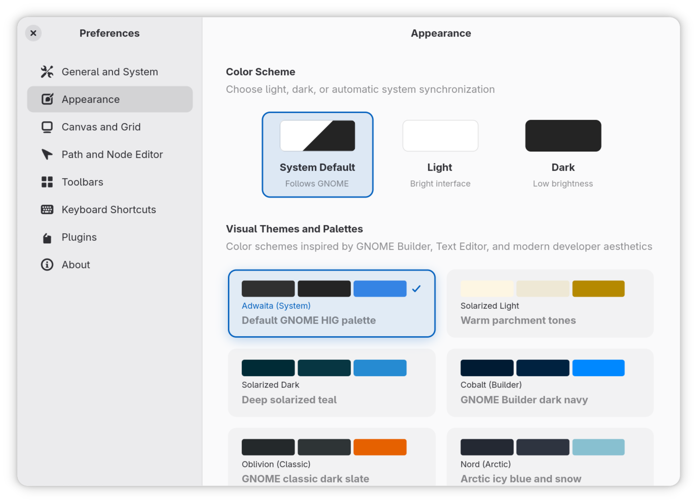

<<<<<<< HEAD
# Gnome Paths


## Getting started

To make it easy for you to get started with GitLab, here's a list of recommended next steps.

Already a pro? Just edit this README.md and make it your own. Want to make it easy? [Use the template at the bottom](#editing-this-readme)!

## Add your files

* [Create](https://docs.gitlab.com/user/project/repository/web_editor/#create-a-file) or [upload](https://docs.gitlab.com/user/project/repository/web_editor/#upload-a-file) files
* [Add files using the command line](https://docs.gitlab.com/topics/git/add_files/#add-files-to-a-git-repository) or push an existing Git repository with the following command:

```
cd existing_repo
git remote add origin https://gitlab.com/lewisHeart/gnome-paths.git
git branch -M main
git push -uf origin main
```

## Integrate with your tools

* [Set up project integrations](https://gitlab.com/lewisHeart/gnome-paths/-/settings/integrations)

## Collaborate with your team

* [Invite team members and collaborators](https://docs.gitlab.com/user/project/members/)
* [Create a new merge request](https://docs.gitlab.com/user/project/merge_requests/creating_merge_requests/)
* [Automatically close issues from merge requests](https://docs.gitlab.com/user/project/issues/managing_issues/#closing-issues-automatically)
* [Enable merge request approvals](https://docs.gitlab.com/user/project/merge_requests/approvals/)
* [Set auto-merge](https://docs.gitlab.com/user/project/merge_requests/auto_merge/)

## Test and Deploy

Use the built-in continuous integration in GitLab.

* [Get started with GitLab CI/CD](https://docs.gitlab.com/ci/quick_start/)
* [Analyze your code for known vulnerabilities with Static Application Security Testing (SAST)](https://docs.gitlab.com/user/application_security/sast/)
* [Deploy to Kubernetes, Amazon EC2, or Amazon ECS using Auto Deploy](https://docs.gitlab.com/topics/autodevops/requirements/)
* [Use pull-based deployments for improved Kubernetes management](https://docs.gitlab.com/user/clusters/agent/)
* [Set up protected environments](https://docs.gitlab.com/ci/environments/protected_environments/)

***

# Editing this README

When you're ready to make this README your own, just edit this file and use the handy template below (or feel free to structure it however you want - this is just a starting point!). Thanks to [makeareadme.com](https://www.makeareadme.com/) for this template.

## Suggestions for a good README

Every project is different, so consider which of these sections apply to yours. The sections used in the template are suggestions for most open source projects. Also keep in mind that while a README can be too long and detailed, too long is better than too short. If you think your README is too long, consider utilizing another form of documentation rather than cutting out information.

## Name
Choose a self-explaining name for your project.

## Description
Let people know what your project can do specifically. Provide context and add a link to any reference visitors might be unfamiliar with. A list of Features or a Background subsection can also be added here. If there are alternatives to your project, this is a good place to list differentiating factors.

## Badges
On some READMEs, you may see small images that convey metadata, such as whether or not all the tests are passing for the project. You can use Shields to add some to your README. Many services also have instructions for adding a badge.

## Visuals
Depending on what you are making, it can be a good idea to include screenshots or even a video (you'll frequently see GIFs rather than actual videos). Tools like ttygif can help, but check out Asciinema for a more sophisticated method.

## Installation
Within a particular ecosystem, there may be a common way of installing things, such as using Yarn, NuGet, or Homebrew. However, consider the possibility that whoever is reading your README is a novice and would like more guidance. Listing specific steps helps remove ambiguity and gets people to using your project as quickly as possible. If it only runs in a specific context like a particular programming language version or operating system or has dependencies that have to be installed manually, also add a Requirements subsection.

## Usage
Use examples liberally, and show the expected output if you can. It's helpful to have inline the smallest example of usage that you can demonstrate, while providing links to more sophisticated examples if they are too long to reasonably include in the README.

## Support
Tell people where they can go to for help. It can be any combination of an issue tracker, a chat room, an email address, etc.

## Roadmap
If you have ideas for releases in the future, it is a good idea to list them in the README.

## Contributing
State if you are open to contributions and what your requirements are for accepting them.

For people who want to make changes to your project, it's helpful to have some documentation on how to get started. Perhaps there is a script that they should run or some environment variables that they need to set. Make these steps explicit. These instructions could also be useful to your future self.

You can also document commands to lint the code or run tests. These steps help to ensure high code quality and reduce the likelihood that the changes inadvertently break something. Having instructions for running tests is especially helpful if it requires external setup, such as starting a Selenium server for testing in a browser.

## Authors and acknowledgment
Show your appreciation to those who have contributed to the project.

## License
For open source projects, say how it is licensed.

## Project status
If you have run out of energy or time for your project, put a note at the top of the README saying that development has slowed down or stopped completely. Someone may choose to fork your project or volunteer to step in as a maintainer or owner, allowing your project to keep going. You can also make an explicit request for maintainers.
=======
<p align="center">
  
</p>

<h1 align="center">GNOME Paths</h1>
<p align="center"><em>Vector graphics and illustration editor for the GNOME desktop.</em></p>

<p align="center">
  🇧🇷 <a href="README.pt-BR.md">Leia em Português</a>
</p>

<p align="center">
  Creating and editing vector graphics on Linux should be fast, responsive, and well-integrated into the desktop environment.
</p>

<p align="center">
  <b>GNOME Paths</b> is a lightweight, hardware-accelerated vector design tool built with <b>GTK4</b>, <b>Libadwaita</b>, <b>Rust</b>, and the <b>Skia 2D</b> graphics engine.
</p>

<div align="center">
  <div style="display: flex; flex-wrap: wrap; justify-content: center; gap: 1em;">
    <a href="https://flathub.org/">
      
    </a>
  </div>
</div>

<div align="center" style="display:flex; justify-content:center; align-items:center; gap:12px; margin-top: 14px;">
    <a href="https://ko-fi.com/lauel" style="display:flex; align-items:center;">
        
    </a>
</div>

---

<p align="center" style="display: flex; justify-content: center; gap: 0.8em; flex-wrap: wrap;">
  
  
  
  
  
</p>

---

## Screenshots

<div align="center" style="display: flex; flex-wrap: wrap; justify-content: center; gap: 16px;">
  
  
</div>

---

## Features

- **Bézier Path Editing**: Node editor with support for cusp, smooth, and symmetric control handles.
- **Parametric Shapes**: Rectangles with independent corner radiuses, circles, stars, polygons, and spirals.
- **Boolean Operations**: Union, Difference, Intersection, Exclusion, Division, and Cut/Slice.
- **Gradients and Mesh**: Linear gradients, radial gradients, and on-canvas editable 2D mesh grids.
- **Multi-Page Artboards**: Manage multiple pages in a single document with individual export options.
- **Export Formats**: SVG, PNG, PDF, JPG, and WebP.
- **Snapping and Guides**: Magnetic snapping to grids, object bounding boxes, and artboard centers.
- **Adaptive Interface**: Follows system dark and light theme preferences with customizable toolbars.

---

## About the Project & Vision

**GNOME Paths** was born out of a love for vector graphics, deeply inspired by the versatility and power of **Inkscape**, with the goal of providing a modern, fast, and responsive experience that feels native to the GNOME desktop.

### Development & Transparency
This project has been extensively coded and iterated with the assistance of **AI pair-programming**, but it is thoughtfully planned, structured, and curated with genuine care and dedication. 

### Future Horizons & Ideas
I'm not entirely sure where this road will take us or how far the project will grow, but there are several ambitious directions under exploration:
- **Workspace-Driven Interface**: A Blender-inspired adaptive interface system where tabs and layouts dynamically adjust depending on the document type and workflow (e.g., Illustration, Precision Pathing, Typography).
- **Vector Animation**: Timeline, keyframing, and motion path support for vector animation.
- **Document Layout & Diagramming**: Advanced multi-page layout and publishing tools for brochures, books, and diagrams.

Many of these are still experimental ideas and concepts that may evolve or take shape as the project matures.

---

## Contributing & Support

Community support is essential to help GNOME Paths grow. If you'd like to get involved, all forms of contribution are warmly appreciated:

- **Bug Reports & Suggestions**: Help us find issues, test edge cases, and propose new workflows on GitLab.
- **Code & Development**: Submit pull requests for performance improvements, tools, or bug fixes.
- **Translations**: Help localize GNOME Paths for your language (see [TRANSLATING.md](TRANSLATING.md)).
- **Financial Support**: If you find the project useful and would like to support ongoing development, consider donating on [Ko-fi](https://ko-fi.com/lauel).

---

## How to Build

### GNOME Builder

1. Install **GNOME Builder** from Flathub.
2. Clone the repository URL `https://gitlab.gnome.org/lewisHeart/gnome-paths.git`.
3. Select the Flatpak runtime configuration.
4. Click **Run** to build and run the application.

### Flatpak CLI

```bash
# Install GNOME 47 SDK and extensions
flatpak install flathub \
  org.gnome.Platform//47 \
  org.gnome.Sdk//47 \
  org.freedesktop.Sdk.Extension.rust-stable//24.08 \
  org.freedesktop.Sdk.Extension.llvm19//24.08

# Build and install
flatpak-builder --user --install --force-clean build-dir io.github.lewis.GnomePaths.json

# Run
flatpak run io.github.lewis.GnomePaths
```

### Meson and Ninja

```bash
meson setup build
ninja -C build
./build/gnome-paths
```

### Cargo

```bash
cargo run --release
```

To run test suites:
```bash
cargo test
```

---

## Translations

Detailed instructions on contributing and managing translations can be found in **[TRANSLATING.md](TRANSLATING.md)**.

---

## Repository and Support

- **GitLab**: [gitlab.gnome.org/lewisHeart/gnome-paths](https://gitlab.gnome.org/lewisHeart/gnome-paths)
- **Ko-fi**: [ko-fi.com/lauel](https://ko-fi.com/lauel)

---

## License

GNOME Paths is licensed under the [GNU General Public License v3.0 or later (GPL-3.0-or-later)](LICENSE).
>>>>>>> b2f4e7b (feat: initialize project structure with core modules, UI components, and asset library)
